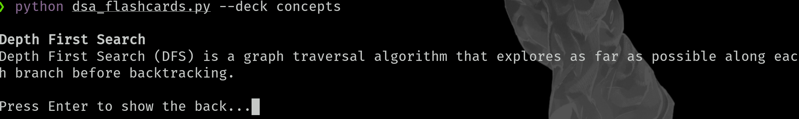
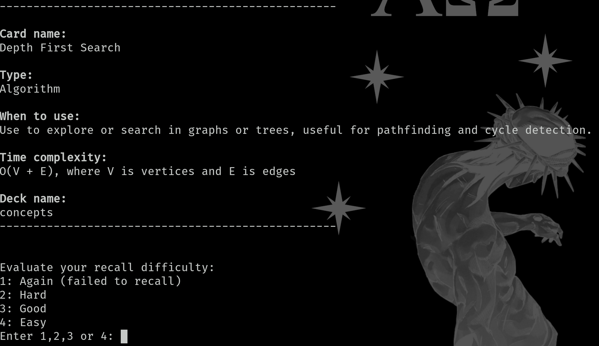
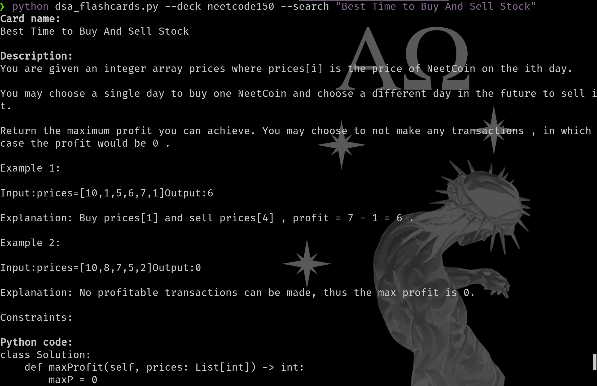
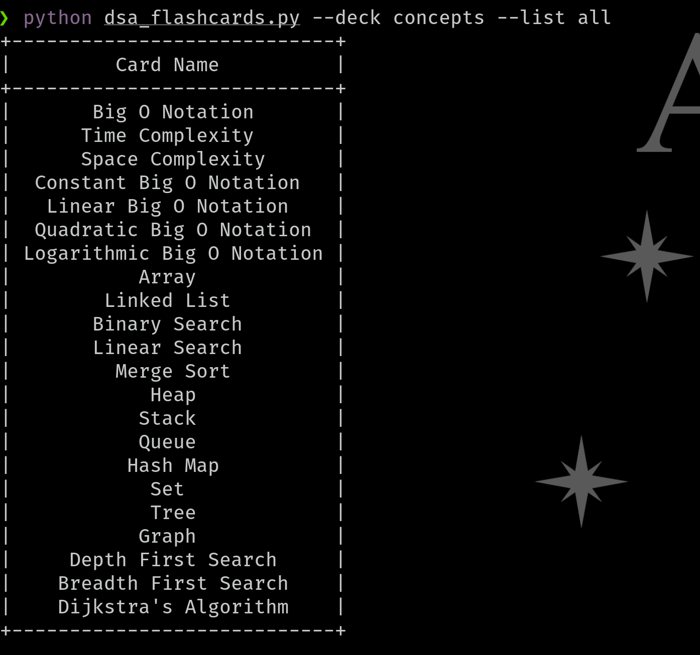
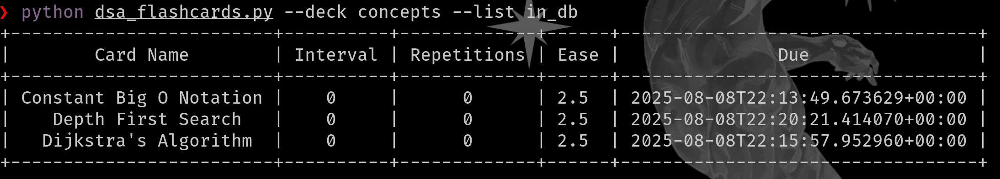

# dsa_flashcards
python script for quick dsa study using a spaced repetition algorithm

## pre-requisites
This project requires the following Python packages:

- prettytable
- anki-sm-2

These can be installed via pip using:
<pre>
pip install prettytable
pip install anki-sm-2
</pre>

## run
python dsa_flashcards.py

## usage
usage: dsa_flashcards.py [-h] --deck DECK [--random] [--num NUM] [--card CARD] [--list]
### default

- only passing deck and nothing else will run the anki sm2 algo on the existing db (or create a new one if not created yet) or pick a random one if the anki algo doesn't find any cards up

### --num
- by default only one card will be shown, explicitly passing num will return the specified number of cards sequentially
- only numbers 1-# of entries in deck will be accepted
### --random
- will pick a random card from the deck, not using any anki algo
### --card
- displays card in deck by name and tests your knowledge
### --search

- prints card in deck by name
### --list [all, in_db]

- can list all the cards in the deck

- or just list cards in_db (cards that have already been seen by the program)

## decks
can be added to ./json
### existing decks
1. concepts
2. neetcode150
